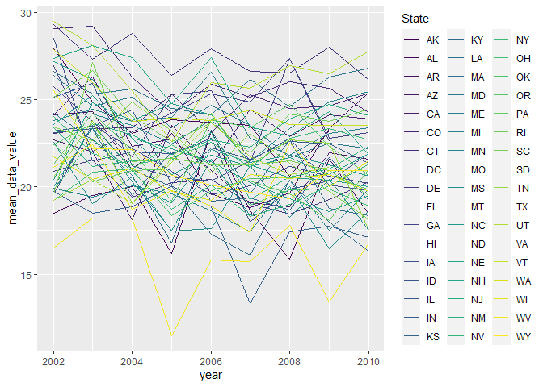
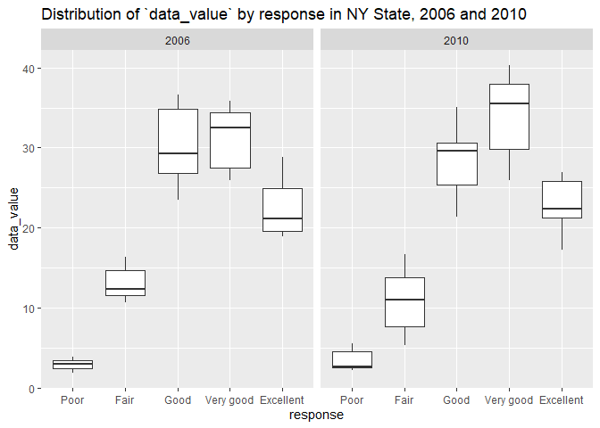
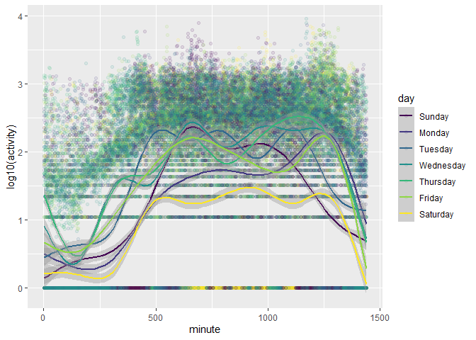

P8105 Homework 3
================
Jesse R. Ames
10/20/2021

*With assistance from Hun Lee and Nikhita Damaraju*

``` r
library(tidyverse)
```

    ## -- Attaching packages --------------------------------------- tidyverse 1.3.1 --

    ## v ggplot2 3.3.5     v purrr   0.3.4
    ## v tibble  3.1.4     v dplyr   1.0.7
    ## v tidyr   1.1.3     v stringr 1.4.0
    ## v readr   2.0.1     v forcats 0.5.1

    ## -- Conflicts ------------------------------------------ tidyverse_conflicts() --
    ## x dplyr::filter() masks stats::filter()
    ## x dplyr::lag()    masks stats::lag()

``` r
library(p8105.datasets)
data("instacart")
```

## Problem 1

1.  How many aisles are there, and which aisles are the most items
    ordered from?

``` r
#How many isles are there?
instacart %>%
  pull("aisle") %>%
  unique() %>%
  length()
```

    ## [1] 134

``` r
#Which aisles are the most items ordered from?
instacart %>%
  pull("aisle") %>%
  janitor::tabyl() %>%
  arrange(desc(n)) %>%
  mutate(percent = round(percent, 2)) %>%
  head(10) %>% #Top 10 aisles by number of items 
  knitr::kable()
```

| .                             |      n | percent |
|:------------------------------|-------:|--------:|
| fresh vegetables              | 150609 |    0.11 |
| fresh fruits                  | 150473 |    0.11 |
| packaged vegetables fruits    |  78493 |    0.06 |
| yogurt                        |  55240 |    0.04 |
| packaged cheese               |  41699 |    0.03 |
| water seltzer sparkling water |  36617 |    0.03 |
| milk                          |  32644 |    0.02 |
| chips pretzels                |  31269 |    0.02 |
| soy lactosefree               |  26240 |    0.02 |
| bread                         |  23635 |    0.02 |

2.  Make a plot that shows the number of items ordered in each aisle,
    limiting this to aisles with more than 10000 items ordered. Arrange
    aisles sensibly, and organize your plot so others can read it.

``` r
instacart %>%
  pull("aisle") %>%
  janitor::tabyl() %>%
  filter(n > 10000) %>%
  arrange(desc(n)) %>%
  ggplot(aes(x = reorder(.,n) , y = n)) +
  geom_col() +
  coord_flip() +
  labs(y = "Number of items ordered",
       x = "Aisle",
       title = "Aisles with more than 10,000 ordered items")
```

<!-- -->

3.  Make a table showing the three most popular items in each of the
    aisles “baking ingredients”, “dog food care”, and “packaged
    vegetables fruits”. Include the number of times each item is ordered
    in your table.

``` r
instacart %>%
  filter(aisle %in% c(
    "baking ingredients",
    "dog food care",
    "packaged vegetables fruits"
  )) %>%
  group_by(aisle) %>%
  count(product_name, sort = TRUE) %>% #We want the top three from each aisle
  slice_head(n = 3) %>% #Decapitation!
  knitr::kable()
```

| aisle                      | product\_name                                 |    n |
|:---------------------------|:----------------------------------------------|-----:|
| baking ingredients         | Light Brown Sugar                             |  499 |
| baking ingredients         | Pure Baking Soda                              |  387 |
| baking ingredients         | Cane Sugar                                    |  336 |
| dog food care              | Snack Sticks Chicken & Rice Recipe Dog Treats |   30 |
| dog food care              | Organix Chicken & Brown Rice Recipe           |   28 |
| dog food care              | Small Dog Biscuits                            |   26 |
| packaged vegetables fruits | Organic Baby Spinach                          | 9784 |
| packaged vegetables fruits | Organic Raspberries                           | 5546 |
| packaged vegetables fruits | Organic Blueberries                           | 4966 |

4.  Make a table showing the mean hour of the day at which Pink Lady
    Apples and Coffee Ice Cream are ordered on each day of the week;
    format this table for human readers (i.e. produce a 2 x 7 table).

``` r
instacart %>%
  filter(product_name %in% c("Pink Lady Apples","Coffee Ice Cream")) %>%
  pivot_wider(names_from = order_dow, values_from = order_hour_of_day) %>%
  select(product_name, all_of(as.character(0:6))) %>%
  group_by(product_name) %>%
  summarize_each(funs(round(mean(., na.rm = TRUE)))) %>%
  knitr::kable(col.names = c("Product","Sunday","Monday","Tuesday","Wednesday","Thursday","Friday","Saturday"),
               caption = "Average hour of day at which Pink Lady Apples and Coffee Ice Cream are ordered on each day of the week")
```

| Product          | Sunday | Monday | Tuesday | Wednesday | Thursday | Friday | Saturday |
|:-----------------|-------:|-------:|--------:|----------:|---------:|-------:|---------:|
| Coffee Ice Cream |     14 |     14 |      15 |        15 |       15 |     12 |       14 |
| Pink Lady Apples |     13 |     11 |      12 |        14 |       12 |     13 |       12 |

Average hour of day at which Pink Lady Apples and Coffee Ice Cream are
ordered on each day of the week

## Problem 2

1.  Clean the data.

``` r
data("brfss_smart2010")
brfss <- brfss_smart2010 %>%
  janitor::clean_names() %>%
  filter(topic == "Overall Health") %>%
  #pull(response) %>% unique() -- We just have responses from "Excellent" to "Poor"
  mutate(
    response = factor(response,
       levels = c("Poor",
                  "Fair",
                  "Good",
                  "Very good",
                  "Excellent")
      )
    )
```

2.  In 2002, which states were represented at 7 or more locations?

``` r
brfss %>%
  filter(year == 2002) %>%
  group_by(locationabbr, locationdesc) %>%
  slice_head() %>% 
  ungroup(locationdesc) %>%
  count(locationabbr, sort = TRUE) %>%
  filter(n >= 7)
```

    ## # A tibble: 6 x 2
    ## # Groups:   locationabbr [6]
    ##   locationabbr     n
    ##   <chr>        <int>
    ## 1 PA              10
    ## 2 MA               8
    ## 3 NJ               8
    ## 4 CT               7
    ## 5 FL               7
    ## 6 NC               7

3.  Construct a dataset that is limited to “Excellent” responses and
    contains year, state, and a variable that averages the `data_value`
    across locations. Make a “spaghetti” plot of this average value over
    time within a state (that is, make a plot showing a line for each
    state across years – the `geom_line` geometry and `group` aesthetic
    will help).

``` r
brfss %>%
  filter(response == "Excellent") %>%
  group_by(locationabbr, year) %>%
  summarise(mean_data_value = mean(data_value)) %>%
  ggplot(aes(x = year,
             y = mean_data_value,
             group = locationabbr,
             color = locationabbr)) +
  geom_line() +
  scale_color_viridis_d() +
  labs(color = "State") #Not the most useful plot
```

    ## `summarise()` has grouped output by 'locationabbr'. You can override using the `.groups` argument.

    ## Warning: Removed 3 row(s) containing missing values (geom_path).

<!-- -->

4.  Make a two-panel plot showing, for the years 2006, and 2010,
    distribution of `data_value` for responses (“Poor” to “Excellent”)
    among locations in NY State

``` r
brfss %>%
  filter(locationabbr == "NY", year %in% c(2006,2010)) %>%
  ggplot(aes(x = response, y = data_value)) +
  geom_boxplot() +
  facet_grid(.~year) +
  labs(title = "Distribution of `data_value` by response in NY State, 2006 and 2010")
```

<!-- -->

## Problem 3

1.  Load, tidy, and otherwise wrangle the data. Your final dataset
    should include all originally observed variables and values; have
    useful variable names; include a weekday vs weekend variable; and
    encode data with reasonable variable classes. Describe the resulting
    dataset (e.g. what variables exist, how many observations, etc).

``` r
accel <- read_csv("accel_data.csv")
```

    ## Rows: 35 Columns: 1443

    ## -- Column specification --------------------------------------------------------
    ## Delimiter: ","
    ## chr    (1): day
    ## dbl (1442): week, day_id, activity.1, activity.2, activity.3, activity.4, ac...

    ## 
    ## i Use `spec()` to retrieve the full column specification for this data.
    ## i Specify the column types or set `show_col_types = FALSE` to quiet this message.

``` r
long_accel <- accel %>%
  janitor::clean_names() %>%
  pivot_longer(cols = starts_with("activity_"),
               names_to = "minute",
               names_prefix = "activity_",
               values_to = "activity") %>%
  mutate(weekend = day %in% c("Saturday","Sunday")) %>% #Make weekend variable (logical)
  select(week, day_id, weekend, day, minute, activity) %>%
  mutate(minute = as.integer(minute), day = factor(day, levels = c(
    "Sunday",
    "Monday",
    "Tuesday",
    "Wednesday",
    "Thursday",
    "Friday",
    "Saturday")))
```

The `long_accel` table contains 50400 rows with the following 6 column
variables: - `week`: week since the start of recording

-   `day_id`: day overall of recording

-   `weekend`: logical variable: was this datapoint taken on a weekend?

-   `day`: day of the week

-   `minute`: minute of the day

-   `activity`: “activity” of the patient as measured by the
    accelerometer

2.  Traditional analyses of accelerometer data focus on the total
    activity over the day. Using your tidied dataset, aggregate accross
    minutes to create a total activity variable for each day, and create
    a table showing these totals. Are any trends apparent?

``` r
long_accel %>%
  group_by(day) %>%
  summarize(sum_activity = sum(activity)) %>% arrange(sum_activity)
```

    ## # A tibble: 7 x 2
    ##   day       sum_activity
    ##   <fct>            <dbl>
    ## 1 Saturday      1369237 
    ## 2 Tuesday       1799238.
    ## 3 Monday        1858699.
    ## 4 Sunday        1919213 
    ## 5 Thursday      2091151.
    ## 6 Wednesday     2129772.
    ## 7 Friday        2291711.

*Remark*: This patient, on average, had the least activity on Saturday
by a substantial margin. Plausibly, this patient has a day off from work
on Saturday.

3.  Accelerometer data allows the inspection activity over the course of
    the day. Make a single-panel plot that shows the 24-hour activity
    time courses for each day and use color to indicate day of the week.
    Describe in words any patterns or conclusions you can make based on
    this graph.

``` r
long_accel %>%
  ggplot(aes(x = minute, y = log10(activity), color = day)) +
  geom_point(alpha = 0.1) +
  geom_smooth() +
  scale_color_viridis_d()
```

    ## `geom_smooth()` using method = 'gam' and formula 'y ~ s(x, bs = "cs")'

<!-- -->

*Remark*: For ease of visualization, I took the `log10` of `activity`.
Given that minute 1 is 12:01 AM and minute 1440 is 12:00 AM the next
day, this patient tends to get up earlier (or perhaps, start their
commute earlier) on Wednesday and Thursday than other days of the week,
at around minute 400 (6:40 AM), and has a drop in activity at minute 800
(1:20 PM) consistent with lunchtime on those days. On other days of the
week, the patient seems to get up and moving later, closer to minute 500
(8:20 AM). On Mondays, Wednesdays, and Fridays, there seems to be a
spike in activity around minute 1300 (9:40 PM), which would seem to
contradict my knee-jerk reaction that this patient might be an observant
Jew. After this late spike, activity gradually decreases on most nights
of the week until about midnight.
