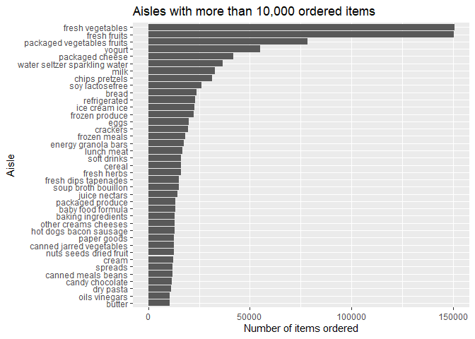

P8105 Homework 3
================
Jesse R. Ames
10/20/2021

``` r
library(tidyverse)
```

    ## -- Attaching packages --------------------------------------- tidyverse 1.3.1 --

    ## v ggplot2 3.3.5     v purrr   0.3.4
    ## v tibble  3.1.4     v dplyr   1.0.7
    ## v tidyr   1.1.3     v stringr 1.4.0
    ## v readr   2.0.1     v forcats 0.5.1

    ## -- Conflicts ------------------------------------------ tidyverse_conflicts() --
    ## x dplyr::filter() masks stats::filter()
    ## x dplyr::lag()    masks stats::lag()

``` r
library(p8105.datasets)
data("instacart")
```

## Problem 1

1.  How many aisles are there, and which aisles are the most items
    ordered from?

``` r
#How many isles are there?
instacart %>%
  pull("aisle") %>%
  unique() %>%
  length()
```

    ## [1] 134

``` r
#Which aisles are the most items ordered from?
instacart %>%
  pull("aisle") %>%
  janitor::tabyl() %>%
  arrange(desc(n)) %>%
  head(10) #Top 10 aisles by number of items ordered
```

    ##                              .      n    percent
    ##               fresh vegetables 150609 0.10877304
    ##                   fresh fruits 150473 0.10867482
    ##     packaged vegetables fruits  78493 0.05668932
    ##                         yogurt  55240 0.03989551
    ##                packaged cheese  41699 0.03011591
    ##  water seltzer sparkling water  36617 0.02644558
    ##                           milk  32644 0.02357619
    ##                 chips pretzels  31269 0.02258314
    ##                soy lactosefree  26240 0.01895109
    ##                          bread  23635 0.01706970

2.  Make a plot that shows the number of items ordered in each aisle,
    limiting this to aisles with more than 10000 items ordered. Arrange
    aisles sensibly, and organize your plot so others can read it.

``` r
instacart %>%
  pull("aisle") %>%
  janitor::tabyl() %>%
  arrange(desc(n)) %>%
  filter(n > 10000) %>%
  ggplot(aes(x = ., y = n)) +
  geom_boxplot()
```

<!-- -->
