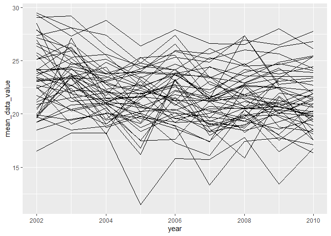
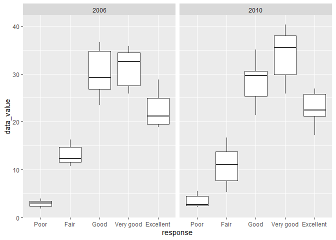

P8105 Homework 3
================
Jesse R. Ames
10/20/2021

*With assistance from Hun Lee and Nikhita Damaraju*

``` r
library(tidyverse)
```

    ## -- Attaching packages --------------------------------------- tidyverse 1.3.1 --

    ## v ggplot2 3.3.5     v purrr   0.3.4
    ## v tibble  3.1.4     v dplyr   1.0.7
    ## v tidyr   1.1.3     v stringr 1.4.0
    ## v readr   2.0.1     v forcats 0.5.1

    ## -- Conflicts ------------------------------------------ tidyverse_conflicts() --
    ## x dplyr::filter() masks stats::filter()
    ## x dplyr::lag()    masks stats::lag()

``` r
library(p8105.datasets)
data("instacart")
```

## Problem 1

1.  How many aisles are there, and which aisles are the most items
    ordered from?

``` r
#How many isles are there?
instacart %>%
  pull("aisle") %>%
  unique() %>%
  length()
```

    ## [1] 134

``` r
#Which aisles are the most items ordered from?
instacart %>%
  pull("aisle") %>%
  janitor::tabyl() %>%
  arrange(desc(n)) %>%
  mutate(percent = round(percent, 2)) %>%
  head(10) %>% #Top 10 aisles by number of items 
  knitr::kable()
```

| .                             |      n | percent |
|:------------------------------|-------:|--------:|
| fresh vegetables              | 150609 |    0.11 |
| fresh fruits                  | 150473 |    0.11 |
| packaged vegetables fruits    |  78493 |    0.06 |
| yogurt                        |  55240 |    0.04 |
| packaged cheese               |  41699 |    0.03 |
| water seltzer sparkling water |  36617 |    0.03 |
| milk                          |  32644 |    0.02 |
| chips pretzels                |  31269 |    0.02 |
| soy lactosefree               |  26240 |    0.02 |
| bread                         |  23635 |    0.02 |

2.  Make a plot that shows the number of items ordered in each aisle,
    limiting this to aisles with more than 10000 items ordered. Arrange
    aisles sensibly, and organize your plot so others can read it.

``` r
instacart %>%
  pull("aisle") %>%
  janitor::tabyl() %>%
  filter(n > 10000) %>%
  arrange(desc(n)) %>%
  ggplot(aes(x = reorder(.,n) , y = n)) +
  geom_col() +
  coord_flip() +
  labs(y = "Number of items ordered",
       x = "Aisle",
       title = "Aisles with more than 10,000 ordered items")
```

<!-- -->

3.  Make a table showing the three most popular items in each of the
    aisles “baking ingredients”, “dog food care”, and “packaged
    vegetables fruits”. Include the number of times each item is ordered
    in your table.

``` r
instacart %>%
  filter(aisle %in% c(
    "baking ingredients",
    "dog food care",
    "packaged vegetables fruits"
  )) %>%
  group_by(aisle) %>%
  count(product_name, sort = TRUE) %>% #We want the top three from each aisle
  slice_head(n = 3) %>% #Decapitation!
  knitr::kable()
```

| aisle                      | product\_name                                 |    n |
|:---------------------------|:----------------------------------------------|-----:|
| baking ingredients         | Light Brown Sugar                             |  499 |
| baking ingredients         | Pure Baking Soda                              |  387 |
| baking ingredients         | Cane Sugar                                    |  336 |
| dog food care              | Snack Sticks Chicken & Rice Recipe Dog Treats |   30 |
| dog food care              | Organix Chicken & Brown Rice Recipe           |   28 |
| dog food care              | Small Dog Biscuits                            |   26 |
| packaged vegetables fruits | Organic Baby Spinach                          | 9784 |
| packaged vegetables fruits | Organic Raspberries                           | 5546 |
| packaged vegetables fruits | Organic Blueberries                           | 4966 |

4.  Make a table showing the mean hour of the day at which Pink Lady
    Apples and Coffee Ice Cream are ordered on each day of the week;
    format this table for human readers (i.e. produce a 2 x 7 table).

``` r
instacart %>%
  filter(product_name %in% c("Pink Lady Apples","Coffee Ice Cream")) %>%
  pivot_wider(names_from = order_dow, values_from = order_hour_of_day) %>%
  select(product_name, all_of(as.character(0:6))) %>%
  group_by(product_name) %>%
  summarize_each(funs(round(mean(., na.rm = TRUE)))) %>%
  knitr::kable(col.names = c("Product","Sunday","Monday","Tuesday","Wednesday","Thursday","Friday","Saturday"),
               caption = "Average hour of day at which Pink Lady Apples and Coffee Ice Cream are ordered on each day of the week")
```

| Product          | Sunday | Monday | Tuesday | Wednesday | Thursday | Friday | Saturday |
|:-----------------|-------:|-------:|--------:|----------:|---------:|-------:|---------:|
| Coffee Ice Cream |     14 |     14 |      15 |        15 |       15 |     12 |       14 |
| Pink Lady Apples |     13 |     11 |      12 |        14 |       12 |     13 |       12 |

Average hour of day at which Pink Lady Apples and Coffee Ice Cream are
ordered on each day of the week

## Problem 2

1.  Clean the data.

``` r
data("brfss_smart2010")
brfss <- brfss_smart2010 %>%
  janitor::clean_names() %>%
  filter(topic == "Overall Health") %>%
  #pull(response) %>% unique() -- We just have responses from "Excellent" to "Poor"
  mutate(
    response = factor(response,
       levels = c("Poor",
                  "Fair",
                  "Good",
                  "Very good",
                  "Excellent")
      )
    )
```

2.  In 2002, which states were represented at 7 or more locations?

``` r
brfss %>%
  filter(year == 2002) %>%
  pull(locationdesc) %>% unique()
```

    ##   [1] "AL - Jefferson County"        "AK - Anchorage Municipality" 
    ##   [3] "AZ - Maricopa County"         "AR - Pulaski County"         
    ##   [5] "AZ - Pima County"             "CA - Los Angeles County"     
    ##   [7] "CO - Adams County"            "CT - Fairfield County"       
    ##   [9] "CO - Arapahoe County"         "CO - Denver County"          
    ##  [11] "CO - Jefferson County"        "CT - New London County"      
    ##  [13] "CT - Hartford County"         "CT - Middlesex County"       
    ##  [15] "CT - New Haven County"        "CT - Tolland County"         
    ##  [17] "CT - Windham County"          "DE - Kent County"            
    ##  [19] "DE - New Castle County"       "DE - Sussex County"          
    ##  [21] "DC - District of Columbia"    "FL - Broward County"         
    ##  [23] "FL - Duval County"            "FL - Hillsborough County"    
    ##  [25] "FL - Miami-Dade County"       "FL - Orange County"          
    ##  [27] "FL - Palm Beach County"       "HI - Maui County"            
    ##  [29] "FL - Pinellas County"         "GA - Cobb County"            
    ##  [31] "GA - DeKalb County"           "GA - Fulton County"          
    ##  [33] "HI - Hawaii County"           "HI - Honolulu County"        
    ##  [35] "HI - Kauai County"            "ID - Ada County"             
    ##  [37] "ID - Canyon County"           "IL - Cook County"            
    ##  [39] "IL - DuPage County"           "IL - Lake County"            
    ##  [41] "IN - Lake County"             "IN - Marion County"          
    ##  [43] "KS - Shawnee County"          "IA - Polk County"            
    ##  [45] "MD - Baltimore city"          "KS - Johnson County"         
    ##  [47] "KS - Sedgwick County"         "KY - Jefferson County"       
    ##  [49] "LA - East Baton Rouge Parish" "LA - Jefferson Parish"       
    ##  [51] "LA - Orleans Parish"          "ME - Cumberland County"      
    ##  [53] "ME - York County"             "MD - Anne Arundel County"    
    ##  [55] "MD - Baltimore County"        "MA - Norfolk County"         
    ##  [57] "MD - Frederick County"        "MD - Montgomery County"      
    ##  [59] "MD - Prince George's County"  "MA - Bristol County"         
    ##  [61] "MA - Essex County"            "MA - Hampden County"         
    ##  [63] "MA - Middlesex County"        "MA - Plymouth County"        
    ##  [65] "MA - Suffolk County"          "MI - Macomb County"          
    ##  [67] "MA - Worcester County"        "MI - Kent County"            
    ##  [69] "MI - Oakland County"          "MI - Wayne County"           
    ##  [71] "MN - Ramsey County"           "MN - Anoka County"           
    ##  [73] "MN - Dakota County"           "MN - Hennepin County"        
    ##  [75] "NE - Lancaster County"        "MS - Hinds County"           
    ##  [77] "MO - Jackson County"          "MO - St. Louis County"       
    ##  [79] "NE - Douglas County"          "NE - Sarpy County"           
    ##  [81] "NV - Clark County"            "NV - Washoe County"          
    ##  [83] "NH - Grafton County"          "NH - Hillsborough County"    
    ##  [85] "NH - Merrimack County"        "NH - Rockingham County"      
    ##  [87] "NH - Strafford County"        "NJ - Bergen County"          
    ##  [89] "NJ - Essex County"            "NC - Henderson County"       
    ##  [91] "NJ - Hudson County"           "NJ - Middlesex County"       
    ##  [93] "NJ - Monmouth County"         "NJ - Morris County"          
    ##  [95] "NJ - Somerset County"         "NJ - Union County"           
    ##  [97] "NM - Bernalillo County"       "NY - Kings County"           
    ##  [99] "NY - Nassau County"           "NY - New York County"        
    ## [101] "NY - Queens County"           "NY - Suffolk County"         
    ## [103] "OH - Lucas County"            "NC - Buncombe County"        
    ## [105] "NC - Forsyth County"          "NC - Guilford County"        
    ## [107] "NC - Mecklenburg County"      "NC - Orange County"          
    ## [109] "NC - Randolph County"         "ND - Cass County"            
    ## [111] "OH - Mahoning County"         "OH - Montgomery County"      
    ## [113] "OH - Summit County"           "OK - Cleveland County"       
    ## [115] "OK - Oklahoma County"         "OK - Tulsa County"           
    ## [117] "OR - Clackamas County"        "PA - Chester County"         
    ## [119] "OR - Multnomah County"        "OR - Washington County"      
    ## [121] "PA - Allegheny County"        "PA - Armstrong County"       
    ## [123] "PA - Bucks County"            "PA - Montgomery County"      
    ## [125] "PA - Delaware County"         "PA - Franklin County"        
    ## [127] "PA - Lancaster County"        "PA - Philadelphia County"    
    ## [129] "PA - Westmoreland County"     "RI - Kent County"            
    ## [131] "RI - Newport County"          "RI - Providence County"      
    ## [133] "RI - Washington County"       "SC - Darlington County"      
    ## [135] "SC - Florence County"         "SC - Richland County"        
    ## [137] "TX - Dallas County"           "SD - Minnehaha County"       
    ## [139] "SD - Pennington County"       "TN - Davidson County"        
    ## [141] "TN - Shelby County"           "TX - Harris County"          
    ## [143] "UT - Davis County"            "UT - Salt Lake County"       
    ## [145] "UT - Summit County"           "VT - Franklin County"        
    ## [147] "UT - Tooele County"           "UT - Weber County"           
    ## [149] "VT - Chittenden County"       "VT - Windsor County"         
    ## [151] "WA - Clark County"            "WA - King County"            
    ## [153] "WA - Pierce County"           "WA - Snohomish County"       
    ## [155] "WV - Kanawha County"          "WI - Milwaukee County"       
    ## [157] "WY - Laramie County"

``` r
  # group_by(locationabbr) %>%
  # summarise(locationabbr,locationdesc) %>%
  # janitor::tabyl(locationabbr) %>% pull(n) %>% sum()
```

3.  Construct a dataset that is limited to “Excellent” responses and
    contains year, state, and a variable that averages the `data_value`
    across locations. Make a “spaghetti” plot of this average value over
    time within a state (that is, make a plot showing a line for each
    state across years – the `geom_line` geometry and `group` aesthetic
    will help).

``` r
brfss %>%
  filter(response == "Excellent") %>%
  group_by(locationabbr, year) %>%
  summarise(mean_data_value = mean(data_value)) %>%
  ggplot(aes(x = year,
             y = mean_data_value,
             group = locationabbr,
             color = locationabbr)) +
  geom_line() +
  scale_color_viridis_d() +
  labs(color = "State") #Not the most useful plot
```

    ## `summarise()` has grouped output by 'locationabbr'. You can override using the `.groups` argument.

    ## Warning: Removed 3 row(s) containing missing values (geom_path).

<!-- -->

4.  Make a two-panel plot showing, for the years 2006, and 2010,
    distribution of `data_value` for responses (“Poor” to “Excellent”)
    among locations in NY State

``` r
brfss %>%
  filter(locationabbr == "NY", year %in% c(2006,2010)) %>%
  ggplot(aes(x = response, y = data_value)) +
  geom_boxplot() +
  facet_grid(.~year)
```

<!-- -->

## Problem 3

1.  Load, tidy, and otherwise wrangle the data. Your final dataset
    should include all originally observed variables and values; have
    useful variable names; include a weekday vs weekend variable; and
    encode data with reasonable variable classes. Describe the resulting
    dataset (e.g. what variables exist, how many observations, etc).

``` r
accel <- read_csv("accel_data.csv")
accel %>%
  janitor::clean_names() %>%
  #names() - That's a lot of columns!
  #pull(day) %>% unique() - Ok, so we have all seven days of the week.
  mutate(weekend = day %in% c("Saturday","Sunday")) %>% #Make weekend variable (logical)
```

2.  Traditional analyses of accelerometer data focus on the total
    activity over the day. Using your tidied dataset, aggregate accross
    minutes to create a total activity variable for each day, and create
    a table showing these totals. Are any trends apparent?

3.  Accelerometer data allows the inspection activity over the course of
    the day. Make a single-panel plot that shows the 24-hour activity
    time courses for each day and use color to indicate day of the week.
    Describe in words any patterns or conclusions you can make based on
    this graph.
